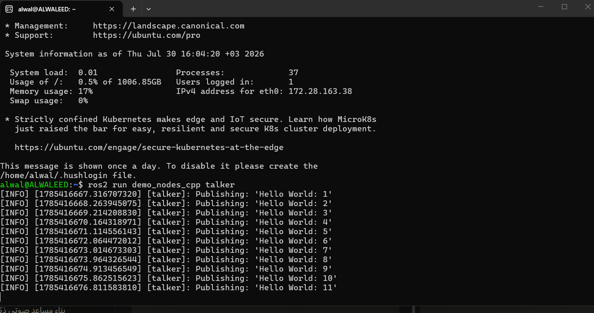
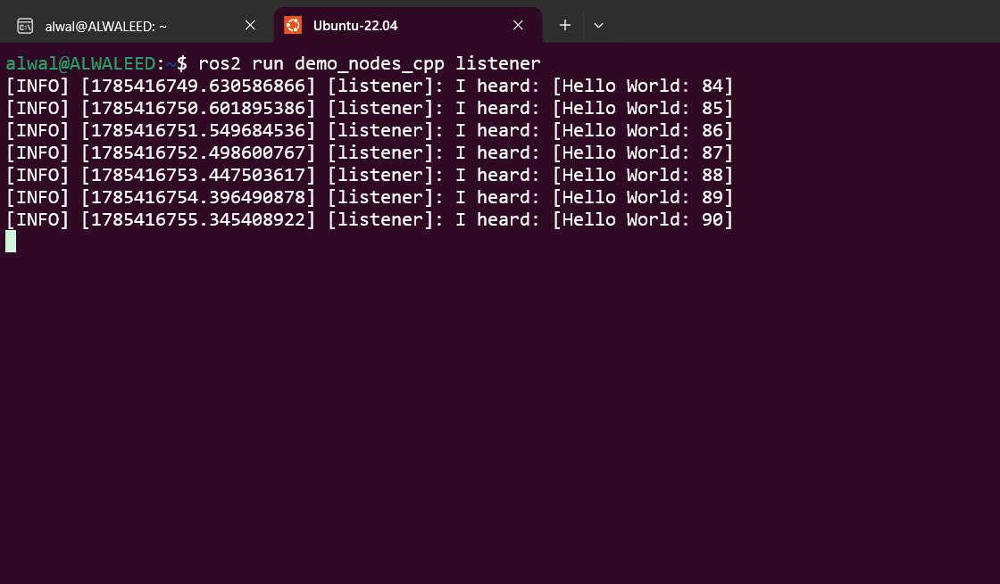

# Task 4: Installing Linux and Running ROS

## Overview
This document covers the steps taken to install a Linux distribution (Ubuntu 22.04) via WSL2 and install and run **ROS2 Humble** on it, along with the actual problems encountered during the process and how they were resolved.

---

## 1. Installing Linux (Ubuntu 22.04) via WSL2

Since ROS2 Humble requires Ubuntu 22.04, **WSL2 (Windows Subsystem for Linux)** was used instead of dual-booting or a virtual machine, since it's faster and simpler.

Open PowerShell **as Administrator** and run:

```powershell
wsl --install -d Ubuntu-22.04
```

Once installation finishes, WSL sets up the new Ubuntu-22.04 instance and prompts you to create a default Unix user account and password.

To verify installed distributions:

```powershell
wsl -l -v
```

---

## 2. Updating the System

Inside the Ubuntu terminal:

```bash
sudo apt update && sudo apt upgrade -y
```

---

## 3. Installing ROS2 Humble

### Adding the official ROS repository

```bash
sudo apt install software-properties-common
sudo add-apt-repository universe

sudo apt update && sudo apt install curl -y
sudo curl -sSL https://raw.githubusercontent.com/ros/rosdistro/master/ros.key -o /usr/share/keyrings/ros-archive-keyring.gpg

echo "deb [arch=$(dpkg --print-architecture) signed-by=/usr/share/keyrings/ros-archive-keyring.gpg] http://packages.ros.org/ros2/ubuntu $(. /etc/os-release && echo $UBUNTU_CODENAME) main" | sudo tee /etc/apt/sources.list.d/ros2.list > /dev/null
```

### Installing the full desktop package

```bash
sudo apt update
sudo apt install ros-humble-desktop -y
```

---

## 4. Enabling and Running ROS

```bash
echo "source /opt/ros/humble/setup.bash" >> ~/.bashrc
source ~/.bashrc
ros2 --version
echo $ROS_DISTRO
```

**Expected output:**
```
alwal@ALWALEED:~$ echo $ROS_DISTRO
humble
```

---

## 5. Testing ROS

In one Ubuntu terminal window:
```bash
ros2 run demo_nodes_cpp talker
```

In a second Ubuntu terminal window:
```bash
ros2 run demo_nodes_cpp listener
```

Messages being exchanged between the two windows confirms ROS is working correctly.

**Talker output:**



**Listener output (receiving messages from the talker):**




As shown above, the listener correctly received and printed the messages published by the talker (`I heard: [Hello World: 84]`, `85`, `86`...), confirming that node-to-node communication in ROS2 is fully functional.

---

## Problems Encountered and Solutions

| Problem | Cause | Solution |
|---|---|---|
| `wsl -l -v` showed "no installed distributions" | The Ubuntu distribution had not actually been installed yet, even though WSL itself was enabled | Ran `wsl --install -d Ubuntu-22.04` again to properly download and install the Ubuntu-22.04 distribution |
| Commands like `source` and `ros2` returned `CommandNotFoundException` | The commands were mistakenly run directly inside **Windows PowerShell** instead of inside the **Ubuntu terminal**, since `source` and `ros2` are Linux/Bash commands, not Windows commands | Opened the Ubuntu app (or ran `wsl` from PowerShell) to enter the Linux environment, then re-ran the commands there |
| `Sorry, passwords do not match` while setting up the Unix user account | Typed the password and its confirmation differently during first-time Ubuntu setup | Re-entered the password carefully when prompted "Try again? [y/N]", after which it was accepted successfully |

---

## Proof of Successful Run

The screenshots above confirm successful installation and configuration:
- The terminal prompt correctly switched to the Ubuntu/Linux environment (`alwal@ALWALEED:~$`).
- The `talker` node successfully published `Hello World` messages.
- The `listener` node, running in a separate terminal tab, successfully received those same messages in real time — proving that ROS2 Humble is fully installed, configured, and operating correctly.

---

## Conclusion
Ubuntu 22.04 was successfully installed via WSL2, ROS2 Humble was installed and configured, and its correct operation was verified. All issues encountered during the process — including the initial failed distribution install, running Linux commands in the wrong terminal, and a password mismatch during account setup — were documented above along with their solutions.
